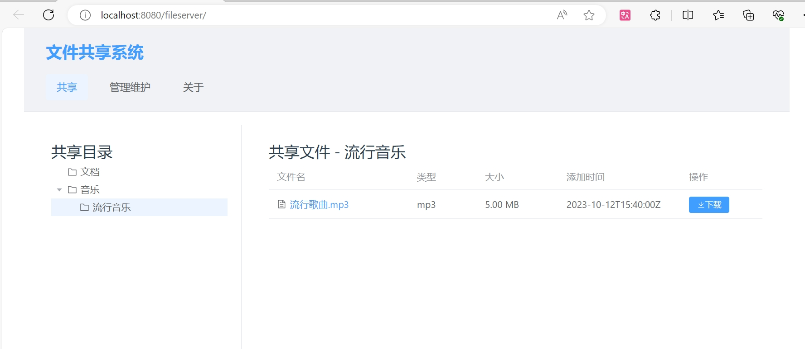
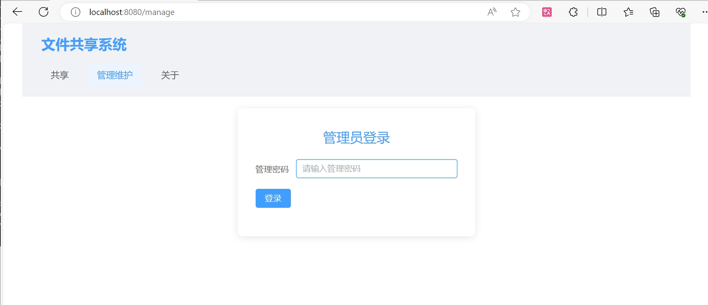
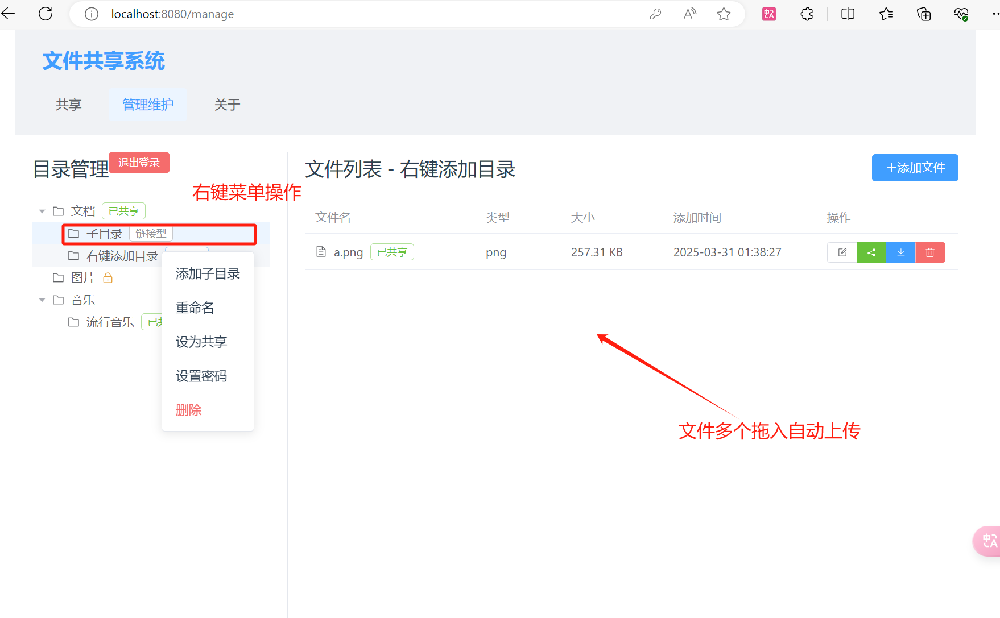

 

# File Sharing System - All-in-One Deployment Guide
# 🌟 Support the Project
If you find this tool useful, please give it a ​star ⭐️ in the top-right corner of the GitHub repository! Your support motivates further development.

## Overview
This system implements file sharing functionality, primarily designed for local sharing needs while also functioning as a file server. Administrators can create shared directories of two types:  
1. **Storage Type**: Uploaded files are stored on the server.  
2. **Link Type**: Directly links to file paths without server storage (ideal for large files over 1GB), retrieving files directly from source disks.  

**Security Note**: When using as a server, disable the `linkDirAdd` option in `server.json` configuration to prevent security risks.

 [Releases FileShare-V20250331 Download](https://github.com/newlxj/FileShare/releases/download/v1.0.0/FileShare-V20250331.zip)
## System Preview
  
  
  

## Technology Stack
• **Frontend**: Vue3  
• **Backend**: Golang  

## Build Instructions

### Automated Build (Recommended)
1. Navigate to `backend` directory  
2. Execute `build.bat`  
   • This script automatically builds both frontend and backend, generating an executable `fileShare.exe` with embedded frontend resources.

### Manual Build
1. **Frontend**:  
   ```bash
   cd frontend
   npm install
   npm run build
   ```
   **Critical Path Adjustment**:  
   After building, modify paths in `web/index.html` and `web/assets/index***.js` by replacing `assets/` with `fileserver/assets/` for Golang embedding.

2. **Backend**:  
   ```bash
   cd backend
   go build -o fileShare.exe
   ```

3. **Full Build**:  
   ```bash
   build.bat
   ```

## Execution
Run the generated executable:  
```bash
./fileShare.exe  # or double-click in Windows
```
• Access URL: http://localhost:8080/fileserver/  
• Default Admin Password: `123456`  

## Configuration Files
| File | Purpose |
|------|---------|
| `server.json` | Server settings (port, context path) |
| `config-group.json` | Directory configurations |
| `config-file.json` | File management settings |

## Key Features
✅ Single executable deployment  
✅ No separate web server required  
✅ Version consistency between frontend/backend  
✅ Portable installation & distribution  
✅ Cross-platform support (Windows/Linux/macOS)  
✅ One-click file service launch  

## Notes
• Configuration files auto-generate on first run  
• Default port: `8080` (configurable)  
• Embedded frontend resources use configured context paths  

---

This translation maintains technical accuracy while optimizing for readability in English documentation standards. The structure preserves original Markdown formatting with improved organization for developer-friendly navigation.